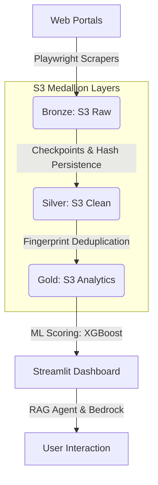

# Real Estate Intelligence Platform (AI-Analyst)

A professional-grade Data Engineering and Analytics platform for the real estate market. This project follows a **"Zero-Cost"** architectural philosophy, maximizing free tiers (AWS, GitHub Actions) while delivering high-value insights through Machine Learning and RAG-based AI.

## 🚀 Key Features

### 1. Fault-Tolerant Multi-Portal Scraping
- **Anti-Bot Resilience**: Built on Playwright for robust extraction from major portals (Finca Raiz, Metrocuadrado, MercadoLibre, Ciencuadras, etc.).
- **Checkpoint System**: Integrated `CheckpointManager` allows scrapers to resume from the last completed page, preventing data loss and redundant operations.
- **Auto-Ingestion**: Scheduled via GitHub Actions CRON jobs for continuous market monitoring.

### 2. Medallion Data Architecture (S3)
- **Bronze Layer**: Raw JSON/Parquet extracted from portals.
- **Silver Layer**: Cleaned and normalized records with coordinated deduplication.
- **Gold Layer**: Analytics-ready dataset with predictive scores and cross-portal metrics.

### 3. AI-Driven Market Intelligence
- **XGBoost Valuation Model**: Predicts Fair Market Value based on physical attributes and NLP-processed titles/descriptions.
- **Opportunity Signals**: Calculates an **"Opportunity Match" (Signal %)** to identify properties listed significantly below estimated market value.
- **Fingerprint-Based Deduplication**: Merges duplicate listings across different portals by verifying physical attributes (Fingerprint), providing a unified market view.

### 4. Interactive Dashboard & RAG Agent
- **Market Gallery**: A didactic UI highlighting top opportunities with direct links to original listings.
- **AI Chatbot (Premium Mode)**: RAG-powered agent for expert consultations on real estate strategy (currently gated for demo mode).
- **Interpretive Guide**: Human-friendly labeling (e.g., "Oportunidad de ahorro") for non-technical users.

## 🏗️ Architecture



## 📁 Project Structure
```text
Real_State_Analyst/
├── app.py                  # Streamlit Dashboard & UI Logic
├── src/
│   ├── scrapers/           # Modular portal scrapers with Checkpoint support
│   ├── utils/              # S3 Connectors, Scorer, and Checkpoint Manager
│   └── ai/                 # RAG logic and LLM orchestration
├── config/                 # Portal-specific settings and models
├── infrastructure/         # Terraform for AWS (IAM, S3)
└── .github/workflows/      # Automated Scraper Cron Jobs
```

## 🛠️ Getting Started

### 1. Prerequisites
- Python 3.11
- AWS Account (S3 Bucket)
- LLM Provider (AWS Bedrock, Ollama, or Groq)

# Install dependencies
pip install -r requirements.txt
playwright install chromium

### 2. Environment Setup
Create a `.streamlit/secrets.toml` file:
```toml
[aws]
aws_access_key_id = "YOUR_KEY"
aws_secret_access_key = "YOUR_SECRET"
aws_region = "us-east-1"
s3_bucket_name = "your-bucket-name"

[llm]
model_name = "us.amazon.llama3-1-70b-instruct-v1:0" # example Bedrock ARN
bedrock_region = "us-east-1"
```

### 3. Running the Platform
```bash
# Start the Dashboard
python -m streamlit run app.py

# Run a specific scraper for testing
python main.py
```

## 🔐 Security & Optimization
- **Least Privilege**: Terraform-managed IAM policies ensure minimal access to S3.
- **Memory Optimized**: Uses `PyArrow` and `S3FS` for stream-reading Parquet files without full local downloads.
- **Demo Mode**: Includes feature gates to control access to premium AI capabilities during demonstrations.

---
*Created by the Real Estate Analyst Team. Focused on making Data-Driven decisions accessible.*
